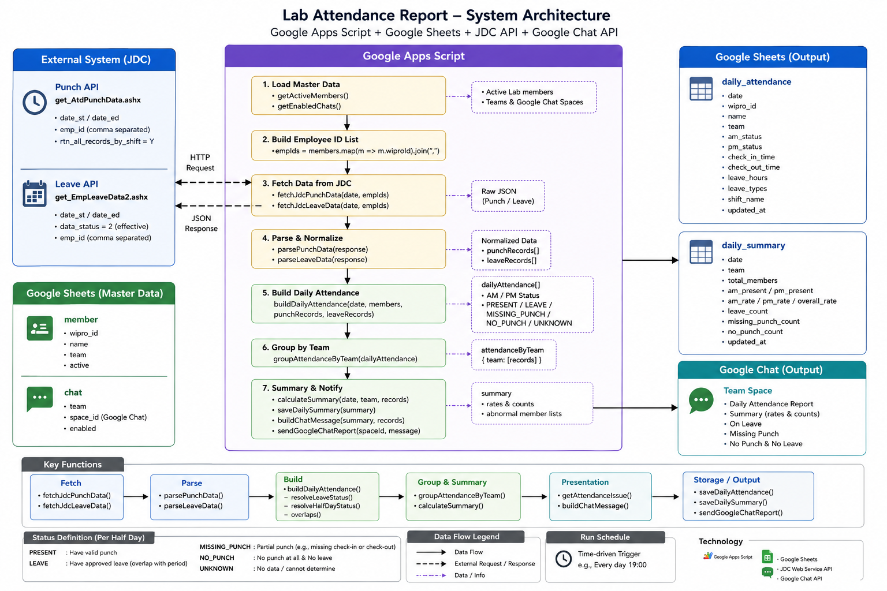

# JDC Attendance Bot

JDC Attendance Bot is a lightweight automation project for retrieving employee attendance data from the JDC API, organizing the information by team, storing structured records in Google Sheets, and publishing daily summaries through the official Google Chat API.

The project is intentionally smaller than Device Test Runner.

The goal is not to build another large framework, but to practice applying software engineering and basic system design concepts to a real operational workflow.



---

# Motivation

The original attendance workflow involves several independent systems:

```text
JDC
Google Sheets
Google Chat
Team / Member Information
```

At first glance, the problem looks simple:

> Retrieve attendance and send a message.

However, once I started thinking about the complete workflow, several design questions appeared.

For example:

```text
Where does member information belong?

Who decides which users should be queried?

Should the JDC API be queried once per member?

Should I query by team?

Should I retrieve everyone at once?

What if the API response becomes too large?

How should the result be summarized?

Who is responsible for sending the Google Chat message?
```

These questions turned a simple script into a small system design exercise.

---

# What the Bot Does

The main workflow is:

```text
Load Members
     │
     ▼
Plan JDC Queries
     │
     ▼
Fetch Attendance Data
     │
     ▼
Parse Attendance
     │
     ▼
Save Daily Attendance
     │
     ▼
Generate Team Summary
     │
     ▼
Save Daily Summary
     │
     ▼
Post to Google Chat
```

The bot can be scheduled using Google Apps Script triggers.

---

# Architecture

The project uses a small set of components:

```text
main.js
    │
    ├── Member Repository
    ├── Query Planner
    ├── JDC Client
    ├── Attendance Parser
    ├── Attendance Summary
    ├── Sheet Repository
    └── Chat Client
```

Detailed architecture documentation:

```text
docs/architecture.md
```

---

# Project Structure

```text
jdc-attendance-bot/
│
├── src/
│   ├── main.js
│   ├── jdc_client.js
│   ├── query_planner.js
│   ├── attendance_parser.js
│   ├── attendance_summary.js
│   ├── sheet_repository.js
│   └── chat_client.js
│
├── test/
│   ├── query_planner.test.js
│   ├── attendance_parser.test.js
│   └── attendance_summary.test.js
│
├── docs/
│   └── architecture.md
│
├── README.md
└── appsscript.json
```

---

# Data Storage

Google Sheets is used as a lightweight datastore.

The project currently expects four logical tables.

## member

```text
wipro_id
name
vendor
google_ldap
team
group
active
```

## daily_attendance

```text
date
wipro_id
name
team
am_status
pm_status
source
updated_at
```

## daily_summary

```text
date
team
total
present
absent
leave
unknown
generated_at
```

## chat

```text
team
space_name
enabled
```

---

# Query Strategy

One of the most interesting parts of the project is deciding how JDC data should be retrieved.

There are several possible strategies.

## Query by Individual

```text
User A → JDC
User B → JDC
User C → JDC
```

This is simple but creates many API requests.

---

## Query by Team

```text
Power Team
    │
    ├── User A
    ├── User B
    └── User C
         │
         ▼
       JDC API
```

This reduces the number of requests and maps naturally to the final attendance summary.

---

## Query by Group

Several teams can be combined into a larger query group.

```text
Hardware
├── Power
├── Camera
└── Display
```

This further reduces request count.

---

## Query All

Another possibility is to retrieve everything first:

```text
JDC API
   │
   ▼
All Attendance
   │
   ▼
Filter Locally
```

This produces very simple application logic, but the API payload may become too large.

---

# Chunk Query

The approach I find most interesting is chunk-based querying.

Instead of:

```text
100 employees
=
100 API calls
```

or:

```text
100 employees
=
1 large API call
```

the bot can use:

```text
100 employees
chunk size = 20

=
5 API calls
```

Example:

```javascript
function chunkArray(items, chunkSize) {
  const chunks = [];

  for (let i = 0; i < items.length; i += chunkSize) {
    chunks.push(items.slice(i, i + chunkSize));
  }

  return chunks;
}
```

This introduces a small but useful system design concept:

> Request size and request count are both resources that need to be balanced.

Chunking gives the application control over that tradeoff.

---

# Orchestration

Another important part of the project is orchestration.

The `main()` function does not need to know all implementation details.

Its job is to coordinate the workflow.

For example:

```javascript
function main() {
  const members = memberRepository.getActiveMembers();

  const chunks = queryPlanner.buildChunks(members);

  const rawAttendance = [];

  for (const chunk of chunks) {
    const result = jdcClient.fetchAttendance(chunk);
    rawAttendance.push(...result);
  }

  const records =
      attendanceParser.parse(rawAttendance, members);

  attendanceRepository.save(records);

  const summaries =
      attendanceSummary.build(records);

  summaryRepository.save(summaries);

  for (const summary of summaries) {
    chatClient.sendSummary(summary);
  }
}
```

The important part is the flow:

```text
Load
→ Plan
→ Fetch
→ Parse
→ Store
→ Summarize
→ Publish
```

This is a small example of orchestration.

---

# What I Learned

This project is much smaller than Device Test Runner, but it gave me another perspective on software architecture.

## 1. Orchestration

One of the first things I noticed was that the main problem was not writing a single API call.

The real problem was connecting several responsibilities together.

```text
Google Sheets
JDC API
Attendance Parsing
Attendance Summary
Google Chat
```

Something has to decide:

```text
what runs first

what data is passed to the next step

what component owns each responsibility

what happens after the data is retrieved
```

That component is effectively an orchestrator.

This is similar to what I learned from Device Test Runner, but at a much smaller scale.

In Device Test Runner, orchestration means coordinating:

```text
device
scenario
lifecycle
executor
artifact
retry
timeout
```

In JDC Attendance Bot, orchestration is simply:

```text
member
→ query
→ attendance
→ summary
→ chat
```

The scale is different, but the thinking pattern is similar.

---

# 2. Starting to Think About System Design

Another interesting learning point was deciding how the JDC API should be queried.

My first thought was:

```text
for each member:
    call JDC API
```

Then I started thinking:

```text
Can I query the API by team?
```

Then:

```text
Can I query by group?
```

Then:

```text
Why not query everyone at once?
```

This gradually became:

```text
Individual
     ↓
Team
     ↓
Group
     ↓
All
```

The interesting part is that none of these approaches is always correct.

Each approach changes:

```text
request count

payload size

execution time

failure scope

memory usage

API quota usage
```

That is where this project started to feel like a small system design problem rather than just an Apps Script.

---

# 3. Chunking

The next step was realizing that I do not necessarily need to choose between:

```text
one person per request
```

and:

```text
everyone in one request
```

I can create a middle layer:

```text
Members
   │
   ▼
Chunks
```

For example:

```text
120 members

chunk size = 20

6 JDC requests
```

This gives much more control over the system.

A chunk becomes a unit of work.

```text
Chunk 1
Chunk 2
Chunk 3
Chunk 4
...
```

If a chunk fails, I can eventually retry only that chunk.

If the JDC API has payload limitations, I can reduce the chunk size.

If API overhead becomes expensive, I can increase the chunk size.

This is a surprisingly simple idea, but it connects directly to larger distributed-system concepts such as:

```text
batching

partitioning

work units

rate limiting

parallelism
```

The project does not need to implement all of these concepts.

However, chunking gave me a concrete example of why they exist.

---

# 4. Modeling and Responsibility Separation

Another lesson was deciding where information belongs.

For example:

```text
member information
```

belongs to the member repository.

```text
JDC HTTP request logic
```

belongs to the JDC client.

```text
attendance interpretation
```

belongs to the attendance parser.

```text
who should be queried together
```

belongs to the query planner.

```text
message delivery
```

belongs to the Chat client.

The resulting flow becomes easier to understand:

```text
MemberRepository
       ↓
QueryPlanner
       ↓
JdcClient
       ↓
AttendanceParser
       ↓
AttendanceRepository
       ↓
AttendanceSummary
       ↓
ChatClient
```

This is probably the biggest difference between writing a script and designing a small application.

A script asks:

> How do I make this run?

Architecture asks:

> Which component should own this responsibility?

---

# 5. Keeping the Architecture Small

One important lesson from Device Test Runner is that architecture can grow very quickly.

Device Test Runner needs concepts such as:

```text
Executor
Lifecycle
Artifact Manager
Artifact Validator
Retry Policy
Failure Classification
Timeout
Controller
Worker
```

JDC Attendance Bot does not need that level of abstraction.

For this project:

```text
simple functions
+
small modules
+
clear responsibilities
```

are enough.

The goal is not:

> Build the most extensible attendance framework possible.

The goal is:

> Build a clean solution for the current problem while leaving obvious extension points.

This is another system design lesson:

> Good architecture is not the architecture with the most layers.

It is the architecture with enough structure for the problem being solved.

---

# Architecture Summary

```text
                       Google Sheets
                            │
                            ▼
                    Member Repository
                            │
                            ▼
                     Query Planner
                            │
                       ┌────┴────┐
                       │ Chunks  │
                       └────┬────┘
                            │
                            ▼
                       JDC Client
                            │
                            ▼
                        JDC API
                            │
                            ▼
                  Attendance Parser
                            │
                            ▼
                 Attendance Repository
                            │
                            ▼
                  Attendance Summary
                            │
                            ▼
                    Google Chat API
```

---

# Current Scope

The initial version intentionally focuses on:

* JDC API integration
* member configuration
* attendance parsing
* Google Sheets persistence
* team summary
* Google Chat API
* query planning
* chunk-based retrieval
* Apps Script scheduling

It intentionally does **not** include:

* distributed execution
* complex retry engines
* message queues
* Kubernetes
* databases
* microservices
* event-driven architecture

Those would add complexity without solving the current problem.

---

# Final Reflection

JDC Attendance Bot looks much smaller than Device Test Runner from a technical perspective.

However, it is useful because I can practice the same engineering thinking on a smaller problem.

Instead of only thinking:

```text
How do I call this API?
```

I started thinking:

```text
Where does this responsibility belong?

What is the data flow?

Who orchestrates the flow?

What is the correct query granularity?

What happens when the dataset grows?

Should I query individual users, teams, groups, or everyone?

Can I divide the workload into chunks?
```

That shift in thinking is more important to me than the size of the project.

The project is therefore not only an attendance bot.

It is also a small exercise in moving from:

```text
scripting
```

toward:

```text
software architecture
+
orchestration
+
system design
```
