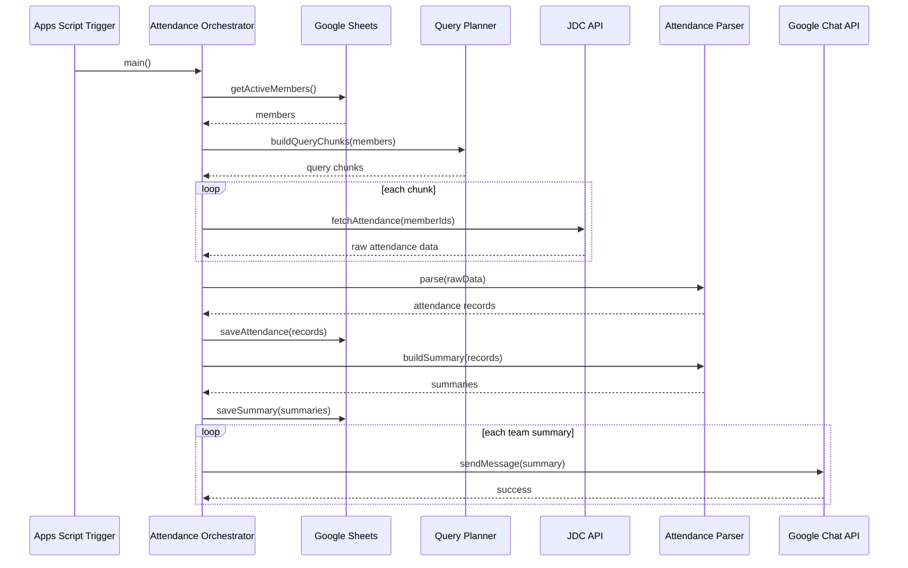
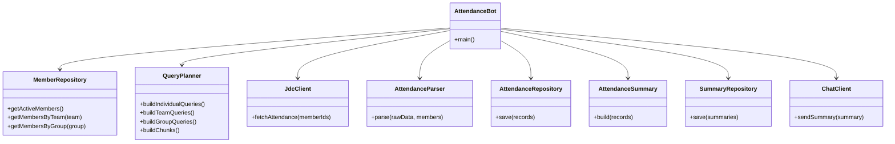

# JDC Attendance Bot — Architecture

## 1. Overview

JDC Attendance Bot is a lightweight automation service that retrieves attendance data from the JDC API, transforms it into team-level attendance summaries, stores structured records in Google Sheets, and publishes daily attendance information to Google Chat through the official Google Chat API.

The project is intentionally small in scope.

Its main goal is not to build a large platform, but to practice several software engineering concepts in a real workflow:

* orchestration
* separation of responsibilities
* API integration
* data modeling
* query strategy
* chunk-based data retrieval
* basic system design

The architecture is designed to remain understandable and maintainable without introducing unnecessary abstraction.

---

# 2. System Context

The system interacts with three main external systems:

1. **JDC API**

   * Source of attendance data.
   * Provides attendance information for employees.

2. **Google Sheets**

   * Stores member configuration.
   * Stores attendance records.
   * Stores daily summaries.
   * Stores Google Chat destination configuration.

3. **Google Chat API**

   * Publishes attendance summaries to the appropriate team space.

High-level flow:

```text
JDC API
   │
   ▼
Attendance Bot
   │
   ├── Parse Attendance
   ├── Generate Summary
   └── Store Results
           │
           ▼
      Google Sheets

Attendance Bot
   │
   ▼
Google Chat API
   │
   ▼
Team Chat Space
```

---

# 3. Architecture Goals

The project focuses on five architectural goals.

## 3.1 Keep the system small

The bot should remain simple enough to understand from the source code without requiring a complex framework.

The expected scale is much smaller than Device Test Runner.

There is no need for:

* distributed workers
* plugin architecture
* complex retry policies
* event-driven messaging
* Kubernetes
* persistent database services

Google Apps Script and Google Sheets are sufficient for the first version.

---

## 3.2 Separate responsibilities

Although the project is small, responsibilities should still be separated.

For example:

```text
JDC Client
    ↓
Attendance Parser
    ↓
Attendance Repository
    ↓
Attendance Summary
    ↓
Chat Client
```

Each component answers a different question.

| Component             | Responsibility                                                      |
| --------------------- | ------------------------------------------------------------------- |
| JDC Client            | How do we retrieve raw attendance data?                             |
| Query Planner         | Who should be queried and how should requests be grouped?           |
| Attendance Parser     | How do we transform JDC responses into internal attendance records? |
| Attendance Repository | How do we read/write Google Sheets?                                 |
| Attendance Summary    | How do we summarize attendance?                                     |
| Chat Client           | How do we send messages to Google Chat?                             |
| Main / Orchestrator   | In what order should everything execute?                            |

---

# 4. High-Level Architecture

```text
                    ┌──────────────────────┐
                    │   Google Apps Script │
                    │       Trigger        │
                    └──────────┬───────────┘
                               │
                               ▼
                     ┌──────────────────┐
                     │   Orchestrator   │
                     │      main()      │
                     └───────┬──────────┘
                             │
          ┌──────────────────┼──────────────────┐
          │                  │                  │
          ▼                  ▼                  ▼
 ┌────────────────┐  ┌────────────────┐  ┌────────────────┐
 │ Member         │  │ Query Planner  │  │ Chat Config    │
 │ Repository     │  │                │  │ Repository     │
 └───────┬────────┘  └────────┬───────┘  └────────────────┘
         │                    │
         │                    ▼
         │            ┌────────────────┐
         │            │   JDC Client   │
         │            └───────┬────────┘
         │                    │
         │                    ▼
         │              ┌───────────┐
         │              │  JDC API  │
         │              └───────────┘
         │
         └──────────────┐
                        ▼
               ┌───────────────────┐
               │ Attendance Parser │
               └─────────┬─────────┘
                         │
                         ▼
               ┌───────────────────┐
               │ Attendance Record │
               └─────────┬─────────┘
                         │
                ┌────────┴────────┐
                ▼                 ▼
       ┌─────────────────┐ ┌──────────────────┐
       │ Google Sheets   │ │ Summary Service  │
       │ Repository      │ └─────────┬────────┘
       └─────────────────┘           │
                                     ▼
                            ┌─────────────────┐
                            │ Google Chat API │
                            └─────────────────┘
```

---

# 5. Data Model

The first version can use four Google Sheets.

## 5.1 member

Stores employee information.

```text
wipro_id
name
vendor
google_ldap
team
group
active
```

Example:

```text
W001 | Andrew | Wipro | andrew@google.com | Power | HW | TRUE
W002 | Alice  | Wipro | alice@google.com  | Power | HW | TRUE
```

---

## 5.2 daily_attendance

Stores normalized attendance records.

```text
date
wipro_id
name
team
am_status
pm_status
source
updated_at
```

Example:

```text
2026-08-26
W001
Andrew
Power
Present
Present
JDC
2026-08-26T09:30:00
```

---

## 5.3 daily_summary

Stores summarized results.

```text
date
team
total
present
absent
leave
unknown
generated_at
```

Example:

```text
2026-08-26
Power
10
8
1
1
0
2026-08-26T09:35:00
```

---

## 5.4 chat

Stores Chat API destination information.

```text
team
space_name
enabled
```

Example:

```text
Power
spaces/AAAA123456
TRUE
```

---

# 6. Internal Domain Models

The implementation does not need a heavy domain model.

Simple JavaScript objects are sufficient.

Example:

```javascript
const member = {
  wiproId: "W001",
  name: "Andrew",
  team: "Power",
  group: "HW",
};
```

Attendance record:

```javascript
const attendance = {
  date: "2026-08-26",
  wiproId: "W001",
  name: "Andrew",
  team: "Power",
  amStatus: "PRESENT",
  pmStatus: "PRESENT",
};
```

Summary:

```javascript
const summary = {
  team: "Power",
  total: 10,
  present: 8,
  absent: 1,
  leave: 1,
};
```

The goal is to model the important concepts without building unnecessary class hierarchies.

---

# 7. Query Strategy

One interesting design problem in this project is:

> How should attendance data be retrieved from the JDC API?

There are several possible strategies.

---

## 7.1 Query by Individual

```text
Member A → API
Member B → API
Member C → API
Member D → API
```

Example:

```javascript
for (const member of members) {
  fetchAttendance(member.wiproId);
}
```

### Advantages

* Simple.
* Easy to retry individual failures.
* Easy to understand.
* Small response payload.

### Disadvantages

* Large number of HTTP requests.
* Slow when the number of members increases.
* May hit API rate limits.

---

# 8. Query by Team

Instead of querying every individual separately:

```text
Power Team
   │
   ├── Member A
   ├── Member B
   ├── Member C
   └── Member D

Power Team → JDC API
```

Example:

```javascript
fetchAttendanceByTeam("Power");
```

### Advantages

* Fewer API requests.
* Matches how attendance summaries are generated.
* Natural grouping for Google Chat.

### Disadvantages

The JDC API may not support team as a native query dimension.

The bot may need to translate:

```text
Team
  ↓
Members
  ↓
Employee IDs
  ↓
JDC Query
```

---

# 9. Query by Group

A group may contain multiple teams.

Example:

```text
Hardware
├── Power
├── Camera
└── Display
```

Possible flow:

```text
group = Hardware

        ↓

find members

        ↓

collect employee IDs

        ↓

query JDC
```

This reduces request count further.

However, the returned payload becomes larger.

---

# 10. Query All

The simplest approach from an application perspective could be:

```text
JDC API
   │
   ▼
All Attendance Data
   │
   ▼
Filter locally
```

Example:

```javascript
const allAttendance = fetchAllAttendance();

const powerAttendance =
    allAttendance.filter(row => powerMemberIds.includes(row.wiproId));
```

### Advantages

* Very simple orchestration.
* Only one API request.
* Easy to generate multiple team summaries.

### Disadvantages

* Response may become very large.
* Slow network transfer.
* Memory usage increases.
* The API may impose response size limits.
* The bot retrieves data it does not need.

---

# 11. Chunk Query

Chunking provides a compromise between:

```text
1 request per member
```

and:

```text
1 giant request for everyone
```

Instead:

```text
Members
   │
   ▼
Split into chunks
   │
   ├── Chunk 1: 20 members
   ├── Chunk 2: 20 members
   ├── Chunk 3: 20 members
   └── Chunk 4: 12 members
```

Each chunk becomes one JDC request.

Example:

```javascript
function chunkArray(items, chunkSize) {
  const chunks = [];

  for (let i = 0; i < items.length; i += chunkSize) {
    chunks.push(items.slice(i, i + chunkSize));
  }

  return chunks;
}
```

Usage:

```javascript
const memberIds = members.map(member => member.wiproId);

const chunks = chunkArray(memberIds, 20);

for (const chunk of chunks) {
  const result = fetchAttendance(chunk);
}
```

---

# 12. Why Chunking?

Chunking balances several concerns.

```text
Too Small
   │
   ▼
Many HTTP Requests
   │
   ▼
Slow / Rate Limit

--------------------------------

Too Large
   │
   ▼
Large Payload
   │
   ▼
Timeout / Memory / API Limit

--------------------------------

Chunk
   │
   ▼
Controlled Request Size
```

For example:

```text
100 members

Individual query
= 100 API requests

Query all
= 1 very large request

Chunk size = 20
= 5 API requests
```

This is a small but practical system design decision.

---

# 13. Query Planner

The query decision can be isolated into a lightweight component.

```text
QueryPlanner
```

Its responsibility is not to call the API directly.

Its responsibility is to decide:

```text
Who should be queried together?
```

Example:

```javascript
function buildQueryChunks(members, chunkSize = 20) {
  const ids = members.map(member => member.wiproId);
  return chunkArray(ids, chunkSize);
}
```

Architecture:

```text
Members
   │
   ▼
Query Planner
   │
   ├── Query Individual
   ├── Query Team
   ├── Query Group
   ├── Query All
   └── Query Chunk
             │
             ▼
          JDC Client
```

For the first production version, chunk query can be the default strategy.

---

# 14. Orchestration

The main function acts as the orchestrator.

Its responsibility is not to implement JDC parsing or Chat APIs.

Instead, it coordinates the workflow.

```javascript
function main() {
  const members = memberRepository.getActiveMembers();

  const chunks = buildQueryChunks(members);

  const rawResults = [];

  for (const chunk of chunks) {
    const result = jdcClient.fetchAttendance(chunk);
    rawResults.push(...result);
  }

  const attendanceRecords =
      attendanceParser.parse(rawResults, members);

  attendanceRepository.save(attendanceRecords);

  const summaries =
      attendanceSummary.build(attendanceRecords);

  summaryRepository.save(summaries);

  for (const summary of summaries) {
    chatClient.sendSummary(summary);
  }
}
```

The orchestration flow is:

```text
Load Configuration
       │
       ▼
Load Members
       │
       ▼
Build Query Plan
       │
       ▼
Fetch JDC Attendance
       │
       ▼
Parse Data
       │
       ▼
Save Attendance
       │
       ▼
Generate Summary
       │
       ▼
Save Summary
       │
       ▼
Publish Google Chat
```

---

# 15. Sequence Diagram



---

# 16. Component Diagram



---

# 17. Suggested Project Structure

The repository does not need many layers.

```text
jdc-attendance-bot/
│
├── src/
│   ├── main.js
│   ├── jdc_client.js
│   ├── query_planner.js
│   ├── attendance_parser.js
│   ├── attendance_summary.js
│   ├── sheet_repository.js
│   └── chat_client.js
│
├── test/
│   ├── query_planner.test.js
│   ├── attendance_parser.test.js
│   └── attendance_summary.test.js
│
├── docs/
│   └── architecture.md
│
├── README.md
└── appsscript.json
```

This keeps the number of modules small while still providing clear responsibility boundaries.

---

# 18. Error Handling

The first version only needs simple error handling.

Possible failures:

```text
JDC API request failed
JDC response invalid
Google Sheet write failed
Google Chat API failed
```

Example:

```javascript
try {
  const result = jdcClient.fetchAttendance(chunk);
  rawResults.push(...result);
} catch (error) {
  console.error("JDC query failed", error);
}
```

Unlike Device Test Runner, the first version does not need:

* failure classification framework
* retry policy objects
* artifact validation
* recovery strategy
* state machine

These features can be added later only if actual operational problems justify them.

---

# 19. Scheduling

Google Apps Script time-driven triggers can execute the bot daily.

Example:

```text
08:30
  │
  ▼
Apps Script Trigger
  │
  ▼
Attendance Bot
  │
  ▼
JDC API
  │
  ▼
Google Sheets
  │
  ▼
Google Chat
```

Possible later schedules:

```text
09:30 AM attendance check

01:30 PM attendance check

05:30 PM daily summary
```

The schedule should remain configuration rather than business logic when possible.

---

# 20. Architecture Evolution

The intended evolution is intentionally conservative.

## v0.1

```text
JDC API
   ↓
Attendance Parser
   ↓
Google Sheets
```

## v0.2

```text
Member Repository
       ↓
Query Planner
       ↓
JDC Client
       ↓
Parser
       ↓
Summary
       ↓
Google Chat
```

## v0.3

Possible additions:

```text
Retry
API quota handling
batch/chunk tuning
error notification
execution metrics
```

Only add these when needed.

The goal is to avoid turning a small attendance bot into a large infrastructure framework.

---

# 21. Key Design Decisions

The important design decisions are:

### Separate API access from business logic

```text
JdcClient != AttendanceParser
```

The API client retrieves data.

The parser understands attendance.

---

### Separate data selection from data retrieval

```text
QueryPlanner != JdcClient
```

The query planner determines:

```text
individual
team
group
all
chunk
```

The JDC client only executes requests.

---

### Use chunking instead of assuming one query strategy

Chunking provides a practical middle ground between:

```text
many tiny requests
```

and:

```text
one huge request
```

---

### Keep orchestration visible

The main flow should remain easy to read.

```text
load
→ plan
→ fetch
→ parse
→ store
→ summarize
→ publish
```

This is intentional.

For a project of this size, readability is more important than creating many abstraction layers.

---

# 22. Summary

JDC Attendance Bot is a small automation project, but it still demonstrates several important software engineering concepts.

The core architecture is:

```text
Google Sheets
     │
     ▼
Member Repository
     │
     ▼
Query Planner
     │
     ▼
JDC Client
     │
     ▼
Attendance Parser
     │
     ▼
Attendance Repository
     │
     ▼
Summary Service
     │
     ▼
Google Chat API
```

The most important architectural idea is not complexity.

It is learning how to divide a real workflow into clear responsibilities and then orchestrate those responsibilities into a complete system.
